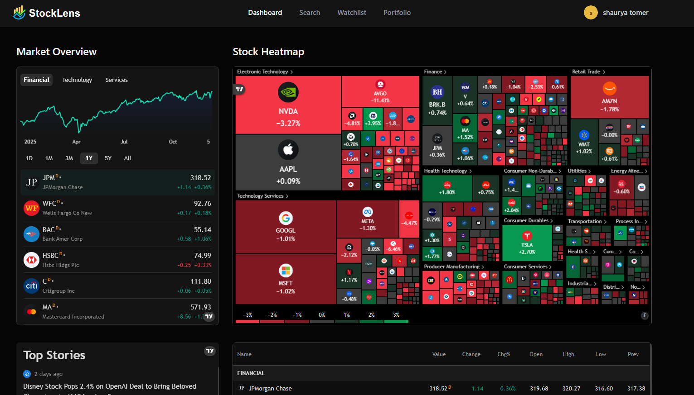

  
  <h1>StockLens</h1>
  

    <strong>Intelligent Portfolio Tracker & Market Analysis Tool</strong>
  

  

    Powered by <strong>Next.js 16</strong>, <strong>AI</strong>, and Real-Time Data.
  

 

  

 

## 🚀 About The Project

**StockLens** is a modern, full-stack financial application designed to give investors a clear edge. It combines real-time stock market data with advanced AI analysis to provide actionable insights into your portfolio.

Forget cluttered spreadsheets. StockLens offers a sleek, responsive interface to track your investments, analyze performance, and discover market trends instantly.

## ✨ Key Features

*   **📈 Real-Time Market Data**: Live stock prices, changes, and market caps powered by the Finnhub API.
*   **🤖 AI-Powered Analysis**: Integrated **Google Gemini AI** to analyze your portfolio and give personalized investment advice.
*   **💼 Portfolio Management**: Add, remove, and track your stock holdings with ease.
*   **⭐ Smart Watchlist**: Keep an eye on potential investments with a synchronized watchlist.
*   **⚡ specific Loading States**: Global progress bars and localized loading spinners for a smooth user experience.
*   **🔐 Secure Authentication**: Robust sign-up and sign-in flow with email validation and password security policies.
*   **🔄 Background Jobs**: Event-driven architecture using **Inngest** for reliable background tasks (e.g., user onboarding).
*   **⚡ Fast Caching**: Redis integration for rate limiting and data caching.

## 🛠️ Tech Stack

Built with the latest web technologies for performance and scalability.

*   **Framework**: [Next.js 16 (App Router)](https://nextjs.org/)
*   **Language**: [TypeScript](https://www.typescriptlang.org/)
*   **Styling**: [Tailwind CSS v4](https://tailwindcss.com/)
*   **Database**: [MongoDB / Mongoose](https://www.mongodb.com/)
*   **Auth**: [Better-Auth](https://github.com/better-auth/better-auth)
*   **Queue/Jobs**: [Inngest](https://www.inngest.com/)
*   **Cache**: [Redis (Upstash / IOredis)](https://redis.io/)
*   **AI**: [Google Gemini](https://deepmind.google/technologies/gemini/)
*   **Market Data**: [Finnhub API](https://finnhub.io/)
*   **Email**: [Nodemailer](https://nodemailer.com/)
*   **Charts**: [TradingView Widgets](https://www.tradingview.com/widget/)

---

